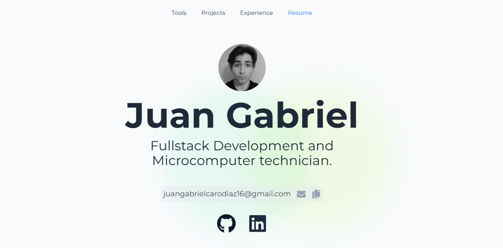

# Portfolio



## Descripción

Este es mi portfolio personal, una single page application (SPA) desarrollada con Next.js y Tailwind CSS. Aquí presento mi experiencia, proyectos y herramientas que utilizo, todo en una interfaz moderna y atractiva.

## Características

- **Introducción**: Incluye mi nombre, correo electrónico, enlaces a LinkedIn y GitHub, y una imagen personal.
- **Menú de Navegación**: Un menú que permite descargar mi CV y navegar a diferentes secciones del portfolio.
- **Daily Tools**: Una sección con animaciones de los logos de las herramientas que utilizo diariamente.
- **Proyectos**: Una galería de mis proyectos con imagen, título, descripción, herramientas utilizadas y enlaces al código o página del proyecto.
- **Timeline**: Un timeline que muestra mis logros y experiencia profesional.


## Tecnologías Utilizadas

- **Next.js**: Framework de React para el desarrollo de aplicaciones web.
- **Tailwind CSS**: Framework de CSS para el diseño y estilización.
- **Vercel**: Plataforma para el despliegue de aplicaciones web.

## Instalación

Para correr este proyecto localmente, sigue estos pasos:

1. Clona el repositorio:
    ```bash
    git clone https://github.com/juangabrieeel/portfolio.git
    ```
2. Navega al directorio del proyecto:
    ```bash
    cd portfolio
    ```
3. Instala las dependencias:
    ```bash
    npm install
    ```
4. Corre el servidor de desarrollo:
    ```bash
    npm run dev
    ```
5. Abre tu navegador en `http://localhost:3000` para ver el proyecto.

## Uso

Una vez que el proyecto esté corriendo, puedes navegar por las diferentes secciones utilizando el menú de navegación en la parte superior. Haz clic en los enlaces de LinkedIn y GitHub para ver mis perfiles y en los proyectos para ver más detalles y acceder al código fuente o a las páginas en vivo.

## Despliegue

El despliegue de este proyecto se realiza en Vercel, que es una plataforma gratuita y fácil de usar para proyectos de Next.js. Aquí están los pasos para desplegar:

1. Conecta tu repositorio de GitHub a Vercel.
2. Importa el proyecto a Vercel desde tu repositorio de GitHub.
3. Configura las opciones de despliegue (Vercel generalmente detecta automáticamente la configuración necesaria para proyectos de Next.js).
4. Haz clic en "Deploy" y espera a que el proceso termine.

Para más detalles, puedes visitar la [documentación de Vercel](https://vercel.com/docs).

## Contribución

Estoy abierto a contribuciones. Si tienes alguna mejora o encuentras algún bug, por favor abre un issue o un pull request en el repositorio de GitHub.

## Contacto

Para cualquier consulta, puedes contactarme a través de [juangabrielcarodiaz16@gmail.com](mailto:juangabrielcarodiaz16@gmail.com).

---

¡Gracias por visitar mi portfolio!

